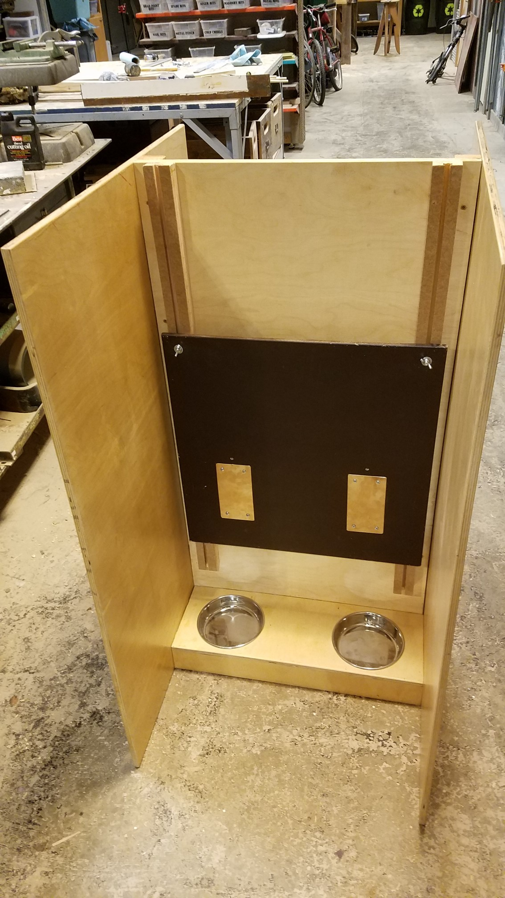
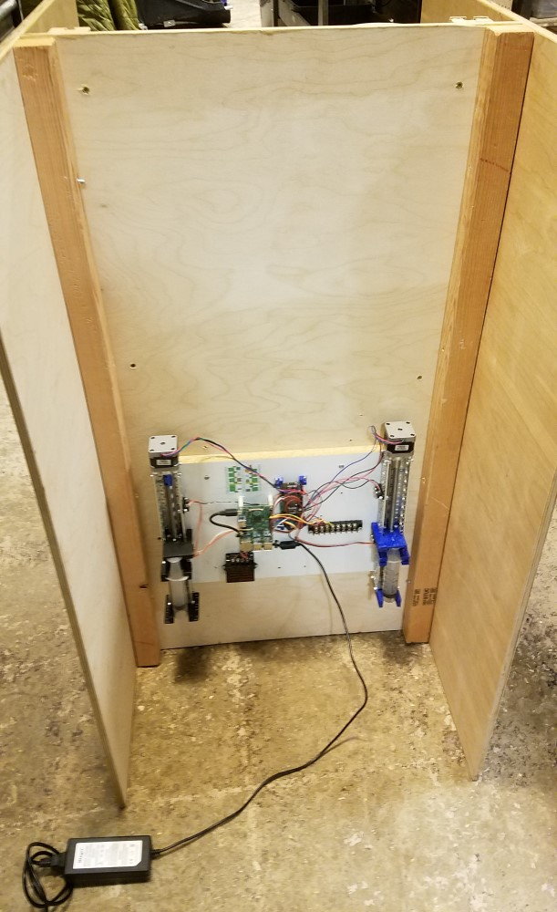
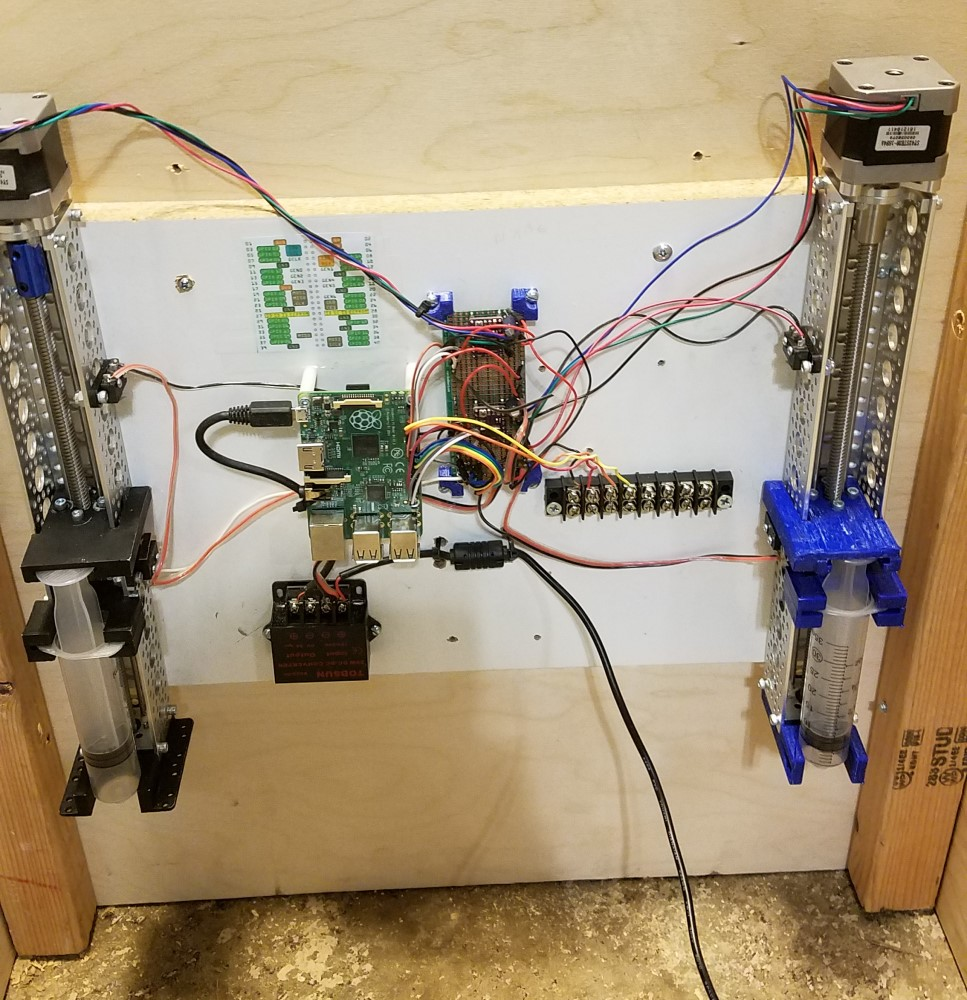

# dogSelfControl
Python module for testing dog sel control. For use with RaspBerry Pi

## Electronics in use
- Stepper Motor: https://www.pololu.com/product/2267/resources
- Motor Driver: https://www.pololu.com/product/2133

